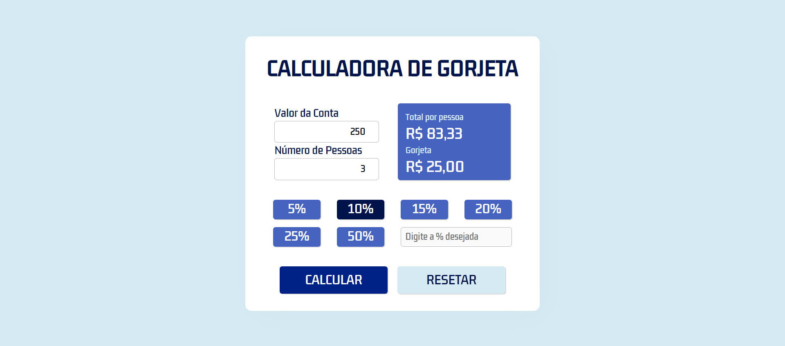

# Calculadora de Gorjeta

Esse projeto consiste em uma calculadora que divide o valor total da conta por uma quantidade _x_ de pessoas e, baseado no valor total, faz um cálculo da gorjeta de acordo com a porcentagem definida pelo usuário. Se não quiser dar gorjeta, não tem problema, é só não selecionar a porcentagem que a divisão do valor total será feito normalmente.

O usuário pode inserir o valor total da conta, a quantidade de pessoas, selecionar a porcentagem da gorjeta ou inserir uma porcentagem personalizada. Após o cálculo ser feito, o usuário pode resetar a calculadora pra fazer um novo cálculo.

Para vê-lo funcionando [CLIQUE AQUI](https://thiagocontelli.github.io/tip-calculator/)

---

## Aqui está uma foto do projeto:

---

## Meus desafios

Eu decidi desenvolvedor esse projeto, principalmente, para aprimorar minhas habilidades em JavaScript tentando ao máximo criar um código limpo e de fácil leitura. Definitivamente tive muito resultado, pois lidei e superei diversos desafios e dificuldades durante o processo, como por exemplo: A manipulação do DOM, eventos e a criação de funções efetivas.

Pude também aprimorar minhas habilidades em HTML e CSS (usando também uma linguagem de extensão do CSS: o SASS).

---
